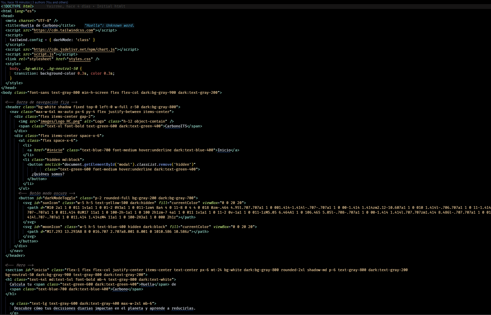
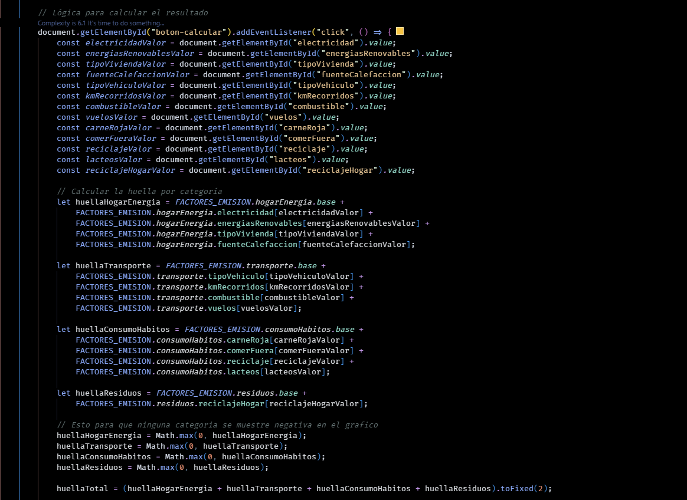

# CarbonoITS

## ¿Qué es la huella de carbono personal?

La huella de carbono personal se refiere a la cantidad total de emisiones de gases de efecto invernadero (principalmente dióxido de carbono, pero también metano y óxido nitroso) que se generan por las actividades cotidianas de una persona.

Estas actividades pueden incluir el consumo de energía en el hogar, el transporte, la alimentación, la ropa, los productos de consumo y otros aspectos de la vida diaria.
Conocer nuestra huella puede ayudarnos a comprender mejor nuestras propias acciones y hábitos y a tomar medidas para reducir nuestras emisiones y minimizar nuestro impacto en el medio ambiente.

## Descripción del proyecto

Desarrollar una aplicación web sencilla que permita a un usuario calcular de manera básica su huella de carbono personal y un apartado para comparar el impacto de ir al trabajo en coche vs. en transporte público (o bicicleta). mostrando la cantidad de CO2 que se ahorra al elegir el transporte público o la bicicleta en lugar del coche.

### Librerías y frameworks

- Tailwind CSS → usado para la maquetación, estilos responsivos, sombras, bordes y soporte de modo oscuro.
- JavaScript Vanilla (DOM API) → para generar dinámicamente el formulario, manejar eventos de botones, calcular la huella y mostrar resultados.
- HTML5 y CSS3 → estructura semántica y estilos básicos complementarios a Tailwind.

### Documentación técnica consultada

- [MDN Web Docs](https://developer.mozilla.org/es/) → referencias de JavaScript, manejo del DOM y eventos.
- [W3Schools](https://www.w3schools.com/) → ejemplos de HTML5 y CSS3.
- [Documentación oficial de Tailwind](https://tailwindcss.com/docs) → clases utilitarias y configuración de responsividad/modo oscuro.

## Capturas de pantalla

Estructura de la página
El código define la estructura básica de la web:

head: Enlaza archivos externos esenciales para el funcionamiento y el diseño, como Tailwind CSS para los estilos, Chart.js para crear gráficos, y archivos locales como script.js y styles.css que contienen la lógica y estilos adicionales.

header: Contiene la barra de navegación, que incluye el logo, enlaces a secciones, un botón para abrir el modal "¿Quiénes somos?" y un interruptor para activar el modo oscuro 🌙.

main: Es el contenedor principal del contenido. Se divide en dos secciones principales:

Una sección más grande (md:col-span-2) que contiene artículos informativos sobre la huella de carbono y botones interactivos.
Una barra lateral (aside) que muestra imágenes relacionadas con el tema.

footer: Contiene la información de la empresa o institución (Instituto Técnico Superior Cipolletti) y avisos de derechos de autor.

script: Incluye un script de JavaScript que gestiona la funcionalidad del modo oscuro y guarda la preferencia del usuario en el navegador (localStorage).

Estilo y diseño
El diseño de la página se basa en la librería Tailwind CSS, que utiliza clases como bg-white, shadow, flex, y p-6 para controlar el espaciado, los colores, las sombras y la disposición de los elementos. Esto permite crear una interfaz moderna y adaptable sin escribir CSS personalizado desde cero.

Interactividad y funcionalidad
El código HTML se integra con JavaScript para ofrecer varias funciones:

Modales: Define un modal (div id="modal") que se muestra u oculta al hacer clic en el botón "¿Quiénes somos?", proporcionando información sobre los desarrolladores.

Botones: Hay varios botones, como "Solicita información" y "Calcular mi huella", que probablemente activan funcionalidades definidas en el archivo script.js (como mostrar un formulario o ejecutar los cálculos).

Modo Oscuro: El botón con los íconos del sol ☀️ y la luna 🌙 permite al usuario cambiar el tema de la página, mejorando la experiencia visual según sus preferencias.

Enlaces: Los enlaces de navegación (<a>) facilitan el desplazamiento a diferentes secciones de la página.

Recopilación de datos
El código utiliza document.getElementById() para obtener los valores de diferentes elementos de un formulario HTML (probablemente campos de entrada o menús desplegables). Estos valores se almacenan en constantes como electricidadValor, vuelosValor, carneRojaValor, etc.

Cálculo de la huella por categoría
Después de recopilar los datos, el script calcula la huella de carbono de forma separada para cuatro categorías principales:

Energía del hogar (huellaHogarEnergia): Suma las emisiones base con las de electricidad, energías renovables, tipo de vivienda y fuente de calefacción.
Transporte (huellaTransporte): Combina las emisiones base con las del tipo de vehículo, kilómetros recorridos, combustible y vuelos.
Consumo y hábitos (huellaConsumoHabitos): Suma las emisiones base con las de consumo de carne roja, comida fuera, reciclaje de materiales y lácteos.
Residuos (huellaResiduos): Calcula la huella de carbono a partir de un valor base y el reciclaje en el hogar.

Ajuste de valores y cálculo total
El script utiliza Math.max(0, ...) para asegurarse de que ninguna de las categorías de la huella de carbono tenga un valor negativo, lo cual es útil para evitar errores al mostrar los datos en un gráfico.

Finalmente, el código suma todas las categorías para obtener la huella de carbono total (huellaTotal) y formatea el resultado para que tenga dos decimales usando .toFixed(2)

## Instalación y ejecución

1. Clonar el repositorio: `git clone https://github.com/Yairrme/CarbonoITS-.git`
2. Abrir `index.html` en navegador.
3. Opcional: usar Live Server en VSCode para refresco automático.

## Uso

- Completar el formulario con tus hábitos.
- Presionar "Calcular" para ver tu huella.
- Reiniciar o volver al contenido principal si lo deseas.

## Fragmentos de código clave

## Referencias

https://www.nationalgeographicla.com/medio-ambiente/que-es-huella-de-carbono-como-se-mide
https://atlas-greenenergy.com/es/que-es-la-huella-de-carbono-personal

## Licencia MIT

Copyright (c) [2025]
[Yair Melinguer,Lucas Duran,Franco Seguel]

Por la presente se concede permiso, de forma gratuita, a cualquier persona que obtenga una copia
de este software y de los archivos de documentación asociados (CarbonoITS), para
utilizarlo sin restricciones, incluyendo sin limitación los derechos a usar, copiar,
modificar, fusionar, publicar, distribuir, sublicenciar, y/o vender
copias del Software, y para permitir a las personas a las que se les proporcione el
Software a hacerlo, sujeto a las siguientes condiciones:

El aviso de copyright anterior y este aviso de permiso se incluirán en todas
las copias o porciones sustanciales del Software.

EL SOFTWARE SE PROPORCIONA "TAL CUAL", SIN GARANTÍA DE NINGÚN TIPO, EXPRESA O
IMPLÍCITA, INCLUYENDO PERO NO LIMITADO A LAS GARANTÍAS DE COMERCIABILIDAD,
IDONEIDAD PARA UN PROPÓSITO PARTICULAR Y NO INFRACCIÓN. EN NINGÚN CASO LOS
AUTORES O TITULARES DE LOS DERECHOS DE AUTOR SERÁN RESPONSABLES DE NINGUNA
RECLAMACIÓN, DAÑOS U OTRAS RESPONSABILIDADES, YA SEA EN UNA ACCIÓN CONTRACTUAL,
AGRAVIO O DE OTRO TIPO, QUE SURJA DE O EN RELACIÓN CON EL SOFTWARE O EL USO U
OTRAS OPERACIONES EN EL SOFTWARE.
