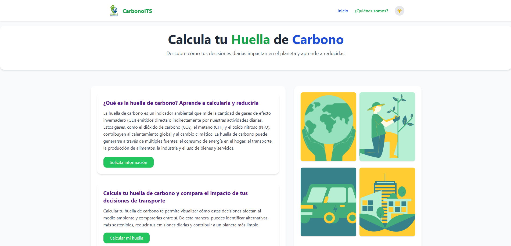
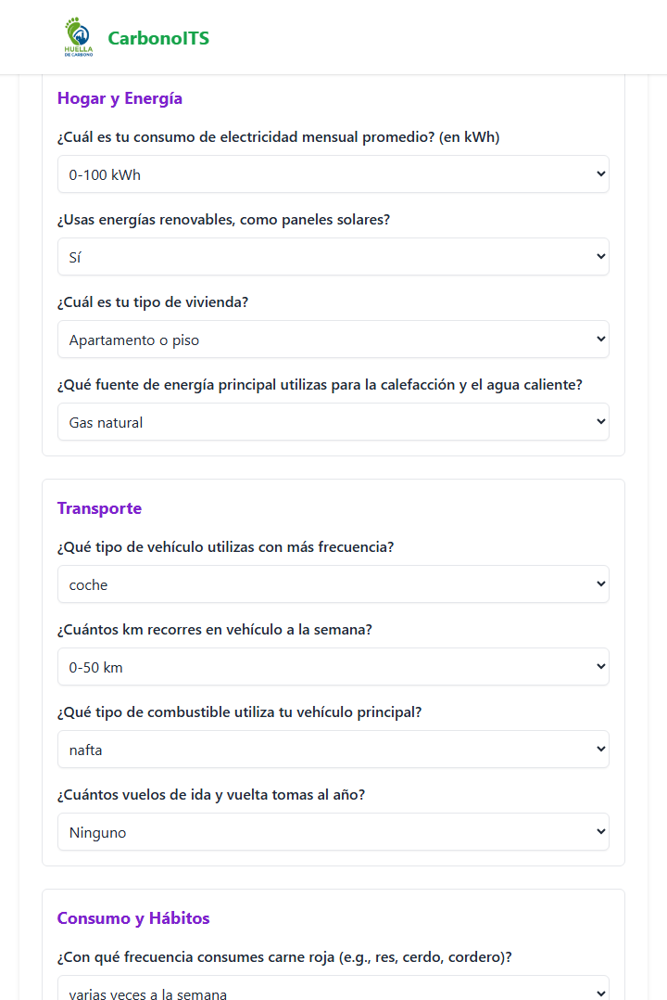
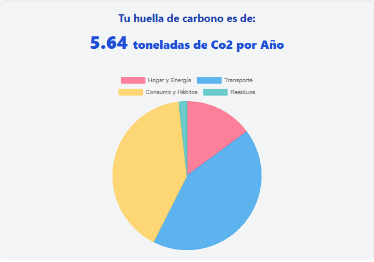

# CarbonoITS

## ¿Qué es la huella de carbono personal?

La huella de carbono personal se refiere a la cantidad total de emisiones de gases de efecto invernadero (principalmente dióxido de carbono, pero también metano y óxido nitroso) que se generan por las actividades cotidianas de una persona.

Estas actividades pueden incluir el consumo de energía en el hogar, el transporte, la alimentación, la ropa, los productos de consumo y otros aspectos de la vida diaria.
Conocer nuestra huella puede ayudarnos a comprender mejor nuestras propias acciones y hábitos y a tomar medidas para reducir nuestras emisiones y minimizar nuestro impacto en el medio ambiente.

## Librerías, documentación y fuentes usadas para el desarrollo

### 📚 Librerías y frameworks

- Tailwind CSS → usado para la maquetación, estilos responsivos, sombras, bordes y soporte de modo oscuro.
- JavaScript Vanilla (DOM API) → para generar dinámicamente el formulario, manejar eventos de botones, calcular la huella y mostrar resultados.
- HTML5 y CSS3 → estructura semántica y estilos básicos complementarios a Tailwind.

### 📖 Documentación técnica consultada

- [MDN Web Docs](https://developer.mozilla.org/es/) → referencias de JavaScript, manejo del DOM y eventos.
- [W3Schools](https://www.w3schools.com/) → ejemplos de HTML5 y CSS3.
- [Documentación oficial de Tailwind](https://tailwindcss.com/docs) → clases utilitarias y configuración de responsividad/modo oscuro.

## Descripción del proyecto

Desarrollar una aplicación web sencilla que permita a un usuario calcular de manera básica su huella de carbono personal y un apartado para comparar el impacto de ir al trabajo en coche vs. en transporte público (o bicicleta). mostrando la cantidad de CO2 que se ahorra al elegir el transporte público o la bicicleta en lugar del coche.

## Capturas de pantalla

## Instalación y ejecución

1. Clonar el repositorio: `git clone https://github.com/Yairrme/CarbonoITS-.git`
2. Abrir `index.html` en navegador.
3. Opcional: usar Live Server en VSCode para refresco automático.

## Uso

- Completar el formulario con tus hábitos.
- Presionar "Calcular" para ver tu huella.
- Reiniciar o volver al contenido principal si lo deseas.

## Fragmentos de código clave

## Referencias

https://www.nationalgeographicla.com/medio-ambiente/que-es-huella-de-carbono-como-se-mide
https://atlas-greenenergy.com/es/que-es-la-huella-de-carbono-personal

## Licencia MIT

Copyright (c) [2025]
[Yair Melinguer,Lucas Duran,Franco Seguel]

Por la presente se concede permiso, de forma gratuita, a cualquier persona que obtenga una copia
de este software y de los archivos de documentación asociados (CarbonoITS), para
utilizarlo sin restricciones, incluyendo sin limitación los derechos a usar, copiar,
modificar, fusionar, publicar, distribuir, sublicenciar, y/o vender
copias del Software, y para permitir a las personas a las que se les proporcione el
Software a hacerlo, sujeto a las siguientes condiciones:

El aviso de copyright anterior y este aviso de permiso se incluirán en todas
las copias o porciones sustanciales del Software.

EL SOFTWARE SE PROPORCIONA "TAL CUAL", SIN GARANTÍA DE NINGÚN TIPO, EXPRESA O
IMPLÍCITA, INCLUYENDO PERO NO LIMITADO A LAS GARANTÍAS DE COMERCIABILIDAD,
IDONEIDAD PARA UN PROPÓSITO PARTICULAR Y NO INFRACCIÓN. EN NINGÚN CASO LOS
AUTORES O TITULARES DE LOS DERECHOS DE AUTOR SERÁN RESPONSABLES DE NINGUNA
RECLAMACIÓN, DAÑOS U OTRAS RESPONSABILIDADES, YA SEA EN UNA ACCIÓN CONTRACTUAL,
AGRAVIO O DE OTRO TIPO, QUE SURJA DE O EN RELACIÓN CON EL SOFTWARE O EL USO U
OTRAS OPERACIONES EN EL SOFTWARE.
